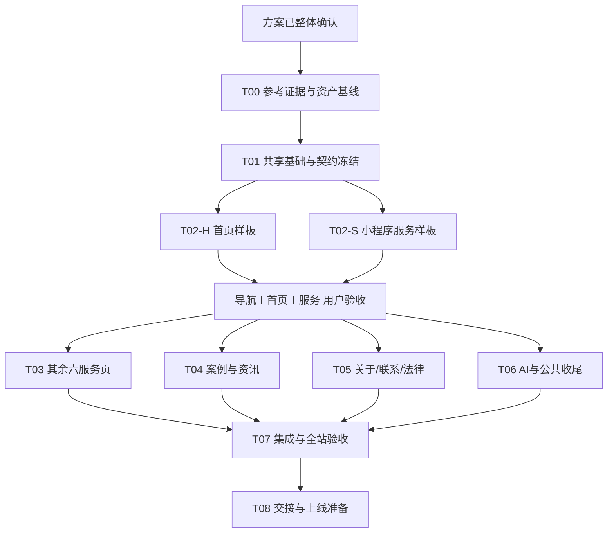

# 分阶段开发计划

版本：1.0 已确认开发基线（2026-09-14）。无硬性完成日期；按依赖和验收推进。下面是任务计划，未创建分支、worktree或开发session。

## 1. 阶段依赖

任何任务进入下游前，依赖应有 commit＋验证证据；“代码写了”不等于契约或样板已经冻结。

## 2. 四个 session

| Session | 核心归属 | 可并行时间 |
| --- | --- | --- |
| A 基础与集成 | 路由/状态/全局样式/共享组件/API适配/mock入口/AI/工具配置/最终合并 | 先独立T00/T01；后为其他任务提供稳定基础并做T06 |
| B 品牌与联系 | 首页、About、Contact、Privacy、Legal，相关内容/字典/素材/测试 | T01后做T02-H；样板批准后T05 |
| C 服务页 | ServiceLanding、七服务配置/字典/素材/测试 | T01后做T02-S；样板批准后T03 |
| D 内容页 | Cases/News列表详情、样本/译文/字典/素材/测试 | 样板批准后T04；提前只读梳理内容不改共享文件 |

并行峰值四个session。B在自己的分支顺序推进首页与公司/联系，不与另一B工作树同时修改同一模块。

## 3. 任务卡

### T00 · 参考证据与资产基线 — A

- 输入：已确认PRD、REFERENCE、原项目基线。
- 产出：代表页面双端截图/关键动效记录、有效源片段坐标、24Logo原始资产与hash/名称、现有双端视频/照片检查、模块对应与差异表。
- 范围：取证与素材登记；不全站移植源站代码、不访问/发送业务表单、不引入源站客服统计。
- 验收：REFERENCE §8逐项有结果或精确缺口；导航六组/33条/28链接/5占位与Logo24清单对账；可复用证据存在于仓库或明确可访问的交接目录。
- 出口：可为公共组件、首页与服务样板提供真实参考。样板依赖的关键视觉缺口未消除不得标T00完成。

### T01 · 共享基础与契约冻结 — A

- 产出：routeManifest、双语模块注册、site/navigation、theme状态机、公共组件、repository/gateway/adapter/mock入口、无密钥.env.example、测试脚本及基础测试。
- 先建完整模块骨架及公共导出，给B/C/D可运行的固定输入。可用最小占位页验证全路由，不把占位当最终页面。
- A在T01同时创建首页可展示的最小固定双语案例/资讯demo fixtures（位于约定的mocks内容目录），保证B不等待尚未启动的D。T01完成后该目录移交D，A不再并行修改其内容；B始终只消费repository。
- NotFound.vue归A：T01建立双语catch-all路由/可用骨架，T06完成视觉和状态验收；AiConsultation/index.vue同归A。
- 旧CSS逐段迁移，隔离旧风格；修复7个存量lint error（或留案例详情4项到D但T07必须清零），建立只读lint基线。
- 共享契约：FRONTEND §2—6、DATA §2—7；所有导出、文件与数据模型在完成记录列出。
- 验收：构建成功；主题边界/语言路由/生产mock防护/数据adapter关键测试通过；手机导航与咨询面板可操作；B/C/D启动不需要猜字段。
- 出口：记录 `foundationCommit`，后续工作树均从该提交开始，不从旧main独立造基础。

### T02-H · 首页样板 — B

- 产出：完整首页，自有双端视频、公司介绍、24Logo固定换序、精选案例/服务/资讯/CTA；中英文与主题齐全。
- 依赖：T01、T00首页证据；首页repository取精选内容，API不足用明确mock，不编真实项目。
- 所有页面样式归Home，公共需求提给A。不得重写全局导航/时间/语言。
- 验收：375/390/430/768/1024/1440/1920代表宽度、双语/主题关键状态；媒体失败和减少动态效果仍可用。

### T02-S · 小程序服务样板 — C

- 产出：共享ServiceLanding模板＋小程序完整双语内容，原其余六路由保持可访问不串数据。
- 依据：应用开发参考页与已确认导航/内容方向；仅真正差异使用配置，不复制七份布局。
- 验收：桌面/手机、中文/英文、浅/深、咨询入口、当前serviceId映射通过。

### 样板验收门 — A 汇总，用户验收

- 先合并T02-H/T02-S到集成分支，验证公共导航＋首页＋小程序完整链路。
- 提供可运行预览、代表截图/录像与有意差异表；用户确认后记录 `pilotCommit`、日期和证据。
- 用户此前已接受这个验收顺序；没有确认不能宣称样板已批准，也不提前展开其他页面视觉定稿。

### T03 · 服务页面族完成 — C

- 配置AI/APP/WEB/IoT/数字文创/定制六类内容，完整双语；四主入口与三次级旧链接正确。
- 复用已批准模板，不逐页发明独立风格；差异仅内容/媒体/必要模块开关。
- 验收：七路由全量、两端两语两主题、缺素材退路、CTA；build＋服务smoke通过。

### T04 · 案例与资讯 — D

- 使用已冻结repository实现列表/基础分类/分页/详情/返回/联系；不做搜索/相关推荐/浏览量。
- 修复案例category/type不一致及资讯未知ID回首篇；适配逻辑由A持有，D通过独立测试或契约变更请求协同，不能各页另做解析。
- 维护案例/资讯mock fixtures与前端译文，明确演示内容；真实清单与译文缺口归B01/B04。
- 验收：加载/空/错误/404/分页能力不足/缺译/危险HTML；列表详情一致，首页精选同源；相关单元/E2E通过。

### T05 · 关于、联系与法律 — B

- 采用已确认品牌与联系方式；公司照片、数字、资质保留；没有电话或真实二维码则不造入口。
- 联系页内嵌表单，字段/状态见DATA；对接A提供的submitInquiry，不直接调用源站提交地址。
- 隐私/法律中英文本对应本项目实际收集方式；生产未接通使用已批准联系退路。
- 验收：国际号码/邮箱、必填/选填、多选/隐私、重复提交、demo/received/unavailable、失败保留与复制；手机键盘下可用。

### T06 · AI 与公共收尾 — A

- 非流式AI兼容、双语UI与人工退路；去掉新版不必要旧组件挂载与全局风格残留。
- 完成NotFound.vue中英视觉、返回/咨询入口，验证中文/英文未知路由与详情缺失状态。
- 对D/B遇到的真实API形状补统一adapter，不改变已冻结消费模型；必要变更先更新契约通知所有任务。
- 整理全站元信息、sitemap已知真实路由、生产mock防护、global焦点/滚动/媒体生命周期。
- 验收：AI不重复发送、错误退路正确；全局状态不被页面覆盖；无源站业务追踪/客服请求。

### T07 · 集成与全站验收 — A，页面负责人修复各自问题

- 顺序合并已完成任务，每次检查build和受影响旅程；最终执行ACCEPTANCE矩阵。
- 对照PRD所有范围、routeManifest、24Logo、33企业条目和七服务，不靠首页截图判断整站完成。
- 新增/重构文件lint无error；全仓7项存量error清零，旧无关warnings单独记录，不全仓无边界格式化。
- 性能优化优先按需导入和资源加载，不单纯降低测试断言或提高chunk warning阈值。
- 验收：自动检查和可执行浏览器矩阵有证据；真机/API缺口如实标未执行，不能把mock当联调。

### T08 · 交接与上线准备 — A

- 产出：最终路由/内容/翻译清单、API接入表、配置示例、生产构建与深链接说明、待验事项、回滚commit与操作说明。
- 确认生产API或已批准退路；移除preview专用入口，生产mock防护检查通过。
- 本任务准备可审查部署结果，不自动发布到外部；用户发出上线指令后按真实环境部署和回滚流程执行。
- 出口：前端交付状态与正式上线状态分别记录。

## 4. 任务跟踪表

下面状态仅由A更新，feature session写自己的交接记录，避免争抢同一文件。

| 任务 | 状态 | 前置 | 负责人 | 完成commit/证据 |
| --- | --- | --- | --- | --- |
| 方案整体确认 | 已确认 | 访谈完成 | 用户 | 2026-09-14当前对话确认 |
| T00 | 未开始 | 方案确认 | A | — |
| T01 | 未开始 | T00 | A | — |
| T02-H | 未开始 | T01 | B | — |
| T02-S | 未开始 | T01 | C | — |
| 样板验收 | 未开始 | T02-H/S集成 | 用户/A | — |
| T03 | 未开始 | 样板批准 | C | — |
| T04 | 未开始 | 样板批准 | D | — |
| T05 | 未开始 | 样板批准 | B | — |
| T06 | 未开始 | 样板批准 | A | — |
| T07 | 未开始 | T03—T06 | A | — |
| T08 | 未开始 | T07 | A | — |

## 5. 开发顺序中的外部缺口

后台缺口不会阻断前端样板：按mock契约推进，并在正式界面提供已批准退路。真实API、首发内容清单/译文、二维码、生产域名/服务器或真机能力缺失，会影响相应真实验收项；记录责任和需要的信息，不擅自扩大到后台建设，也不把所有工作暂停等资料。
